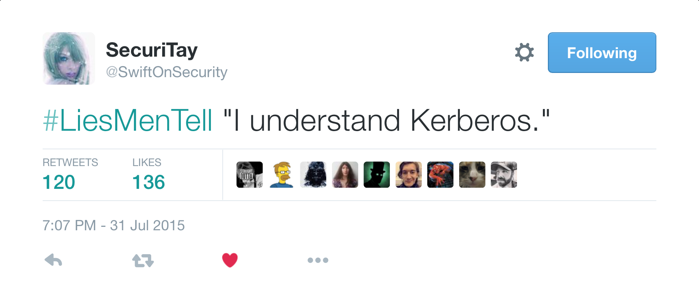

## Building Cyber Exercise Environments  

**Matt Kaar**  
Cyber Workforce Development  
AnsibleFest 2015  

<pre style="font-size:0.4em">
Copyright 2015 Carnegie Mellon University

This material is based upon work funded and supported by the Department of Defense under
Contract No. FA8721-05-C-0003 with Carnegie Mellon University for the operation of the
Software Engineering Institute, a federally funded research and development center.

Any opinions, findings and conclusions or recommendations expressed in this material are
those of the author(s) and do not necessarily reflect the views of the United States
Department of Defense.

References herein to any specific commercial product, process, or service by trade name,
trade mark, manufacturer, or otherwise, does not necessarily constitute or imply its
endorsement, recommendation, or favoring by Carnegie Mellon University or its Software
Engineering Institute.

NO WARRANTY. THIS CARNEGIE MELLON UNIVERSITY AND SOFTWARE ENGINEERING INSTITUTE MATERIAL
IS FURNISHED ON AN "AS-IS" BASIS. CARNEGIE MELLON UNIVERSITY MAKES NO WARRANTIES OF ANY
KIND, EITHER EXPRESSED OR IMPLIED, AS TO ANY MATTER INCLUDING, BUT NOT LIMITED TO,
WARRANTY OF FITNESS FOR PURPOSE OR MERCHANTABILITY, EXCLUSIVITY, OR RESULTS OBTAINED
FROM USE OF THE MATERIAL. CARNEGIE MELLON UNIVERSITY DOES NOT MAKE ANY WARRANTY OF ANY
KIND WITH RESPECT TO FREEDOM FROM PATENT, TRADEMARK, OR COPYRIGHT INFRINGEMENT.

This material has been approved for public release and unlimited distribution. Please
see Copyright notice for non-US Government use and distribution.

This material may be reproduced in its entirety, without modification, and freely
distributed in written or electronic form without requesting formal permission.
Permission is required for any other use. Requests for permission should be directed to
the Software Engineering Institute at permission@sei.cmu.edu.

Carnegie Mellon&reg; and CERT&reg; are registered marks of Carnegie Mellon University.

DM-0003066
</pre>

<!-- .element: style="background:none; border:none; box-shadow:none;" -->

## Cyber Intrusions

The Internet can be a dangerous place&hellip;

Sony Pictures

Note:
* Response to planned release of *The Interview* starring Seth Rogen and James Franco

<!-- .slide: data-background="images/sony-wapost.png" -->
&nbsp;

Ashley Madison

Note:
* PII for 33 million accounts released
* "Full delete" option still retained GPS coordinates of each account.

<!-- .slide: data-background="images/ashleymadison-arstechnica.png" -->
&nbsp;

Penn State University  
College of Engineering

<!-- .slide: data-background="images/pennstate-recode.png" -->
&nbsp;

Note:
* Attack began in 2012.
* Discovered in 2014, attacker identity unknown.
* Cut connection to the Internet in mid-2015.
* 18,000 staff and students notified that PII was compromised.

U.S. Department of Defense  
Joint Chiefs of Staff

<!-- .slide: data-background="images/jointstaff-wsj.png" -->
&nbsp;

> (&hellip;) an unclassified email system (&hellip;) was taken down for 12 days after they received sophisticated "spear-phishing" emails (&hellip;)
>
> The emails appeared to be from USAA, a bank that serves military members, and each sought to persuade the recipient to click a link that would implant spyware into the system.

[www.latimes.com/nation/la-na-cyber-spy-20150831-story.html](http://www.latimes.com/nation/la-na-cyber-spy-20150831-story.html)

United States  
Office of Personnel Management

<!-- .slide: data-background="images/opm-nytimes.png" -->
&nbsp;

<!-- .slide: data-background="images/opm-fingerprints.png" -->

## Cyber Exercises

Defenders need practice.

Facebook

<!-- .slide: data-background="images/facebook-red-team.png" -->
&nbsp;

PhishMe

<!-- .slide: data-background="images/phishme-gets-phished.png" -->
&nbsp;

**CERT Division**  
Software Engineering Institute  
Carnegie Mellon University

Practice hands-on cyber offense and defense

Simulation, Training and Exercise Platform (STEP)

<!-- .slide: data-background="images/stepfwd-training.png" -->
&nbsp;

<!-- .slide: data-background-video="videos/step-vdot-demo.mp4" -->
&nbsp;

Diverse Virtual Machine Environments

<!-- .slide: data-background="images/logos-os-cloud.png" data-transition="fade" data-background-transition="slide" -->

### Operating Systems/Cloud <!-- .element: style="color: #FFF; background: #88A9C0;" -->

<!-- .slide: data-background="images/logos-networking.png" data-transition="fade" data-background-transition="slide" -->

### Networking <!-- .element: style="color: #FFF; background: #B2A175;" -->

<!-- .slide: data-background="images/logos-security.png" data-transition="fade" data-background-transition="slide" -->

### Security <!-- .element: style="color: #FFF; background: #B17A75;" -->

<!-- .slide: data-background="images/logos-web-databases.png" data-transition="fade" data-background-transition="slide" -->

### Web/Databases <!-- .element: style="color: #FFF; background: #8AB575;" -->

<!-- .slide: data-background="images/logos-apps-development.png" data-transition="fade" data-background-transition="slide" -->

### Apps/Development <!-- .element: style="color: #FFF; background: #639DA6;" -->

User simulation

<!-- .slide: data-background="images/gus-animated.gif" -->
&nbsp;

Note:
* Impossible to fill an exercise with a realistic user population
* Need to create users that perform normal behaviors to create the 'noise' and keep defenders honest
* Users 'complain' when things don't work.

Automated Assessment

Note:
* Constructive Feedback
* Scoreboard
* Rankings

Gaming Elements

<!-- .slide: data-background="images/video-games-training-tool.png" -->
&nbsp;

## Exercise Construction

<!-- .element: class="fragment" style="color:#ccc" -->AKA, where **Ansible** fits in to all of this&hellip;

 <!-- .element: style="background:none; border:none; box-shadow:none;height:108px;" --> 

> Ansible's goals are foremost those of simplicity and 
> maximum ease of use. It also has a strong focus on security and
> reliability, featuring a minimum of moving parts,
> usage of OpenSSH for transport (&hellip;),
> and a language that is designed around auditability
> by humans &mdash; even those not familiar with the program.

[docs.ansible.com](http://docs.ansible.com)

### First Contact&mdash;October 2012

<pre>
On Sun, Oct 14, 2012 at 4:55 PM, Matt Kaar wrote:

Jason,

&lt;snip&gt;

In other news, I stumbled across this distributed SSH tool that will
hopefully make it easier to run jobs across our many sensors.

http://ansible.cc/

I know you've already got Python scripts cooked up for your backend
stuff, but figured I'd pass it along just in case.

-Matt
</pre>

### Old Construction Process

1. Build virtual machine from scratch or clone existing disk.

2. <!-- .element: class="fragment" -->Make changes that add uniqueness to VM&mdash;add
   scripts to apply custom variables at deploy-time.

3. <!-- .element: class="fragment" -->Save new disk image ready for future deploy.

### Issues

Finished virtual machines became stale over time. No quick way to
recreate them&mdash;lots of patch jobs.

Too much effort applied to keep *opaque VMs* up and running (domain
controllers, Exchange servers, etc.)

Process revolved around logic stored in individual
VMs&mdash;orchestration was difficult.

### Project EMMET

<!-- .element: class="fragment" style="background:none; border:none; box-shadow:none; height:200px; width:200px;" -->

<!-- .element: class="fragment" -->_The Master Builder_

EMMET's Build Process

<!-- .slide: data-background="images/emmet-workflow.png" -->
&nbsp;

EMMET's Toolkit

### Packer

<!-- .element: style="background:none; border:none; box-shadow:none; height:300px;" -->

ISOs go in, *seed images* come out.

A **seed image** is a minimal OS install ready for Ansible management
(SSH or WinRM enabled).

### Seed Image Pipeline

* Windows (XP/7/8/10)
* Windows Server (2003/2008/2012)
* CentOS
* Ubuntu
* Security Onion
* Kali Linux
* Arch Linux
* CoreOS
* VyOS
* pfSense
* Solaris
* VMware ESXi

### Ansible

 <!-- .element: style="background:none; border:none; box-shadow:none;height:216px;" --> 

Takes a _seed image_ and automates **everything else**.

* Windows Domain Install
* Adding Synthetic User Accounts
* MS Exchange/Email Setup
* Manage a Certificate Authority
* Multi-network DHCP
* Purposely inserting vulnerabilities into VMs
* Inserting malware/bots in a simulated Internet
* Deploying the STEP platform itself

Why we chose Ansible&hellip;

### Readability

With many exercise developers on the team, we needed a tool that kept
playbooks simple.

<!-- .element: class="fragment" -->Also, 'dusting off' older playbooks to use down the road needed to be as
painless as possible.

### <i class="fa fa-windows" style="color:#00aef0;"></i>&nbsp;&nbsp;Windows Support&nbsp;&nbsp;<i class="fa fa-windows" style="color:#00aef0;"></i>

Many of our playbooks involve setting up Windows applications and
services (Active Directory, Exchange, IIS, MSSQL, SharePoint)

<!-- .element: class="fragment" data-fragment-index="1" -->* **Dear
Red Hat:**
Please keep Windows support. :) &num;ansibleallthethings*

### Separation of Playbooks and Roles

Playbooks are focused at the project level&mdash;include specific implementation details.

Roles stay more generic (i.e. Active Directory install, deploy botnet, etc.)&mdash;encourages reuse among teams.

<pre style="font-size:0.7em;">
$ tree -d emmet-ansible
emmet-ansible
&boxvr;&boxh;&boxh; group_vars -> playbooks/customerA/group_vars
&boxvr;&boxh;&boxh; library
&boxvr;&boxh;&boxh; playbooks
&boxv;   &boxur;&boxh;&boxh; customerA
&boxv;       &boxur;&boxh;&boxh; group_vars
&boxv;   &boxur;&boxh;&boxh; customerB
&boxv;       &boxur;&boxh;&boxh; group_vars
&boxur;&boxh;&boxh; roles
    &boxvr;&boxh;&boxh; apache_web
    &boxv;   &boxur;&boxh;&boxh; tasks
    &boxvr;&boxh;&boxh; domain_controller_2008
    &boxv;   &boxvr;&boxh;&boxh; files
    &boxv;   &boxur;&boxh;&boxh; tasks
</pre>

## What's Next?

### Domain Auth via Kerberos

<!-- .element: style="background:none; border:none; box-shadow:none;" -->

### Continuous Integration

First with seed images&hellip;

<!-- .slide: data-background="images/gitlab-ci.png" -->
&nbsp;

&hellip;then with Ansible roles.

<!-- .slide: data-background="images/serverspec.png" -->
&nbsp;

Finally, playbooks for entire exercise environments.

### Takeaways

1. Ansible allows us to move faster and with better repeatability.

2. <!-- .element: class="fragment" -->Simple enough to get the entire team building playbooks.

3. <!-- .element: class="fragment" -->Extensible to hardware and operating systems outside of supported Ansible modules.

## The End

Matt Kaar  
<i class="fa fa-twitter" style="color:#55ACEE"></i> @mattkaar
